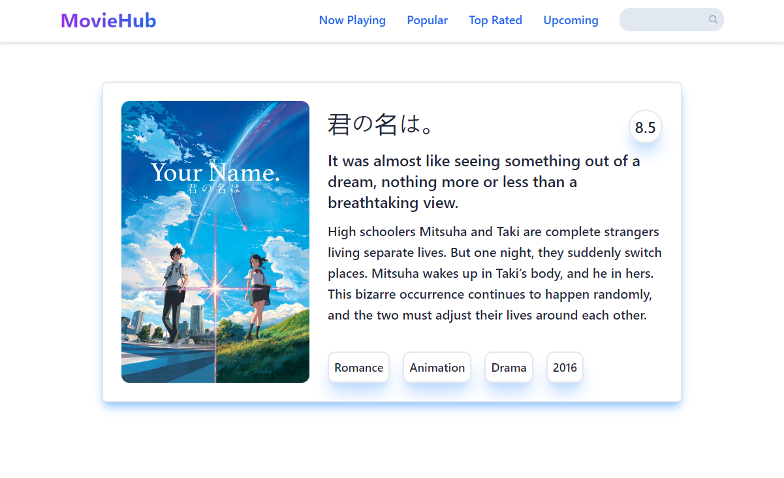

# MovieHub - Your Ultimate Movie Database App

MovieHub is a React project that's perfect for anyone who loves movies. It taps into TMDB API to fetch all sorts of movie details. Whether you're looking for what's currently showing, the most talked-about films, or just want to search for a movie you're interested in, MovieHub makes it easy.

## Features

MovieHub offers an array of features to enhance your movie exploration:

- **Now Playing**: Get the scoop on movies currently lighting up the big screen.
- **Popular Picks**: Browse the movies that are trending and capturing audiences around the globe.
- **Top Rated**: Discover movies that have been acclaimed by critics and fans alike for their excellence.
- **Search Bar**: Find any movie in the extensive TMDB database with an easy-to-use search feature.
- **Movie Details**: Click on any movie to view its detailed information, including plot summaries, cast lists, and more.

## Technologies Used

- **React:** JavaScript library for creating user interfaces with a focus on a reactive user experience.
- **React Router:** A tool for handling in-app navigation and rendering components seamlessly.
- **Tailwind CSS:** A utility-first CSS framework for quickly designing custom user interfaces.
- **JavaScript:** Programming language for implementing app functionalities and interactions.
- **React Query:** Hooks for managing, caching, and synchronizing asynchronous and remote data.
- **Vite:** A modern frontend build tool that significantly improves the development experience.
- 
## Screenshots




## Getting Started

To get started with the project, follow these steps:

1. **Clone the repository:**

   ```sh
   git clone https://github.com/ozergklp/MovieHub.git
   cd MovieHub
2. **Install dependencies:**

   ```sh
   npm install
3. **Start the development server:**

   ```sh
   npm run dev ---- 
